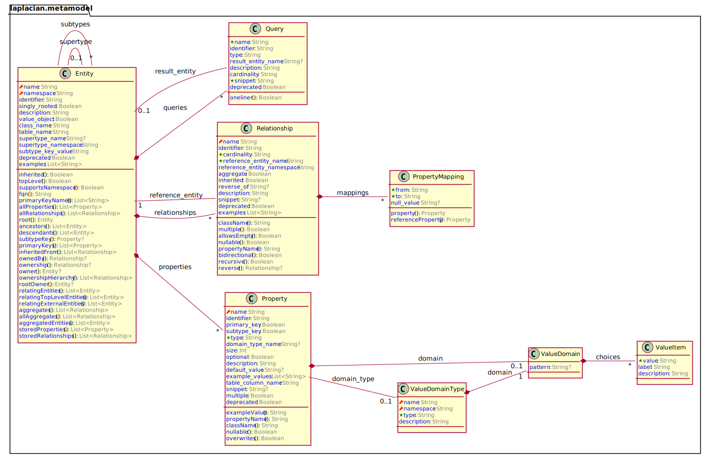

# laplacian:model:metamodel
This model expresses the structure of models. In other words, this model explains
how to define "a model".
## The structure of the metamodel model
The following diagram summarizes the structure of the model.
This model does not have any dependency to external models.

## Getting started
To generate some resources from this model, firstly,
add the following entry to your `laplacian-module.yml` :
```yaml
project:
  models:
  - group: laplacian
    name: metamodel
    version: "1.0.0"
```
Then create the template which refers the model for example: 
*template/demo/entity_list.md.hbs*
```handlebars
## The list of entities
{{#each entities as |entity|}}
- {{entity.name}}
{{/each}}
```
The following file will be emitted if you type `gradle lG` in your terminal:
*demo/entity_list.md*
```markdown
## The list of entities
- entity
- property
- relationship
...
```